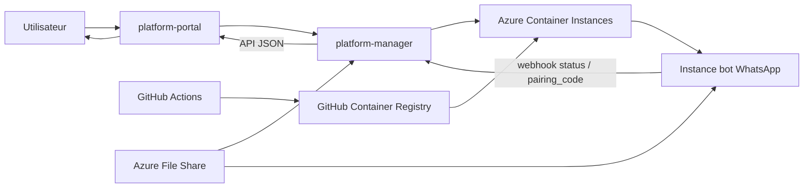
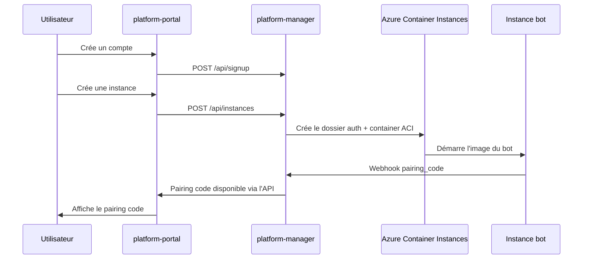

# Architecture globale

## Objectif

Chaque utilisateur crée un compte dans le portail. Le portail appelle le backend `platform-manager`, qui provisionne une instance dédiée du bot sur Azure Container Instances et expose le pairing code au navigateur.

## Composants

- **Bot WhatsApp**: `index.js` + Baileys, mode `PAIRING_MODE=true`, dossier d'auth par instance.
- **platform-manager**: API Fastify, stockage local JSON, provisionnement ACI, gestion des webhooks.
- **platform-portal**: app Next.js, routes API proxy, interface de gestion.
- **Azure Container Instances**: exécution du manager, du portail et des instances bot.
- **Azure File Share**: persistance du dossier `auth_info` par utilisateur.
- **GitHub Actions**: build et push des images vers GHCR puis déploiement sur ACI.
- **GHCR**: registre privé pour les images container.

## Diagramme d'architecture

## Séquence de création d'instance

## Flux de données

- Le navigateur ne parle jamais directement à Azure.
- `platform-portal` appelle uniquement son backend Next.js.
- `platform-manager` détient les secrets de déploiement et les secrets du stockage Azure.
- Le bot garde son état dans un dossier d'auth distinct par utilisateur.

## Décisions importantes

- **Une instance par utilisateur** pour séparer l'état et les sessions.
- **Pairing code** plutôt que QR pour améliorer l'expérience mobile.
- **File Share** pour rendre le dossier d'auth persistant entre redémarrages.
- **GHCR privé** pour éviter d'exposer l'image du bot.
