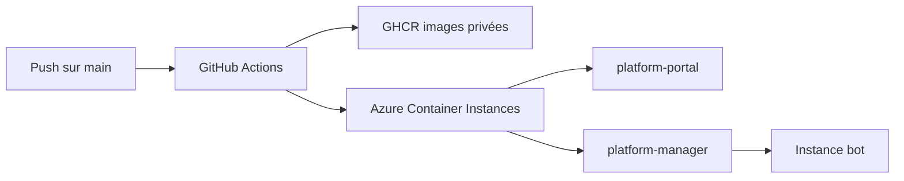

# Déploiement Azure et CI/CD

## Chaîne de déploiement

## Variables et secrets GitHub

### Secrets

- `AZURE_CREDENTIALS`
- `AZURE_STORAGE_KEY`
- `ADMIN_TOKEN`
- `PLATFORM_ADMIN_TOKEN`
- `GEMINI_API_KEY`
- `AZURE_REGISTRY_USERNAME`
- `AZURE_REGISTRY_PASSWORD`

### Variables

- `AZURE_RESOURCE_GROUP`
- `AZURE_LOCATION`
- `AZURE_STORAGE_ACCOUNT`
- `AZURE_FILE_SHARE`
- `AZURE_REGISTRY_SERVER`
- `ACI_CONTAINER_NAME`
- `ACI_DNS_LABEL`
- `ACI_PORT`
- `ACI_CPU`
- `ACI_MEMORY`
- `PORTAL_CONTAINER_NAME`
- `PORTAL_DNS_LABEL`
- `PORTAL_PORT`
- `PORTAL_CPU`
- `PORTAL_MEMORY`
- `MANAGER_DNS_LABEL`
- `BOT_ACI_IMAGE`
- `DATA_FILE`
- `BOT_NAME`
- `PREFIX`
- `ASSISTANT_MODE`
- `UNLIMITED_MODE`
- `SYNC_FULL_HISTORY`
- `PROCESS_OLD_MESSAGES`
- `AUTO_VIEWONCE`
- `CREATOR_NAME`
- `GITHUB_LINK`
- `COOLDOWN_MS`
- `COMMAND_LIMIT`
- `OWNER_NUMBERS`

## Ordre de mise en place

1. Créer le groupe de ressources Azure.
2. Créer le Storage Account.
3. Créer le File Share.
4. Créer ou réutiliser un Service Principal avec rôle Contributor sur le groupe de ressources.
5. Créer les secrets GitHub.
6. Pousser les workflows.
7. Lancer les workflows manuellement si nécessaire.

## Détails manager

Le workflow `platform-manager`:

- construit l'image du manager,
- pousse l'image `ghcr.io/skjuv/platform-manager-aci:latest`,
- crée l'ACI du manager,
- injecte `ADMIN_TOKEN`, `BOT_ACI_IMAGE`, `AZURE_STORAGE_KEY`, `AZURE_REGISTRY_*`.

## Détails portal

Le workflow `platform-portal`:

- construit l'image du portail,
- pousse l'image `ghcr.io/skjuv/platform-portal-aci:latest`,
- crée l'ACI du portail,
- injecte `PLATFORM_MANAGER_URL`, `PLATFORM_ADMIN_TOKEN`, `AZURE_REGISTRY_*`.

## Commandes de vérification

- Vérifier les conteneurs Azure.
- Vérifier les logs ACI.
- Vérifier les routes `/health` et l'UI du portail.

## Cas d'erreur fréquents

- **Image inaccessible**: vérifier les secrets GHCR.
- **Azure login failed**: vérifier `AZURE_CREDENTIALS`.
- **CrashLoopBackOff**: vérifier les variables runtime du manager.
- **Pairing code absent**: vérifier le webhook et le mode `PAIRING_MODE`.
